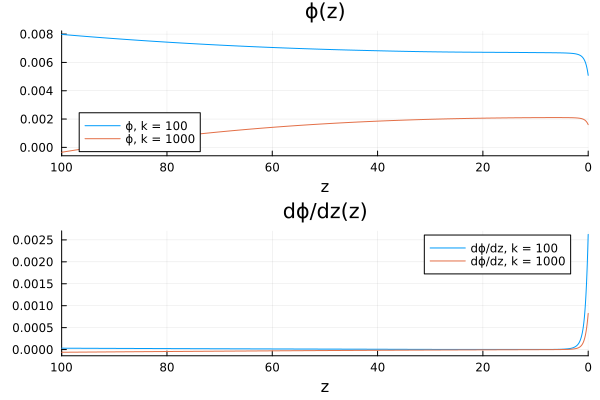
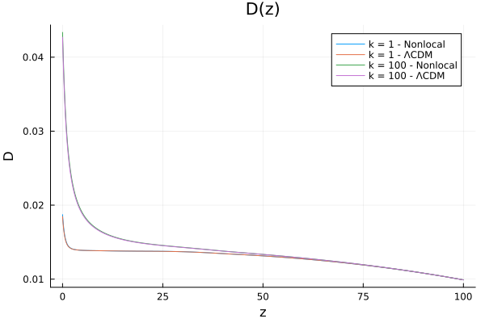
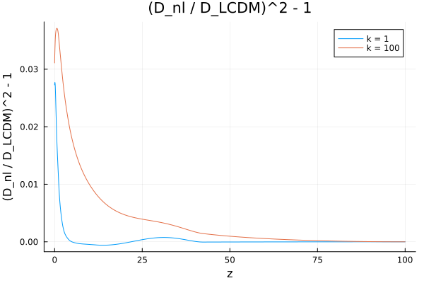
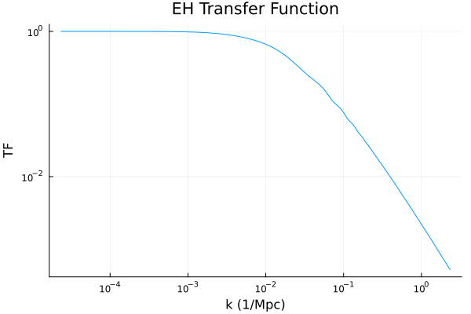
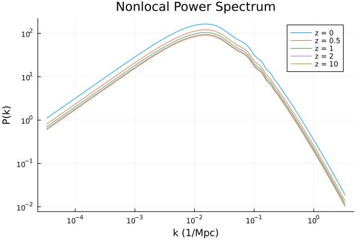
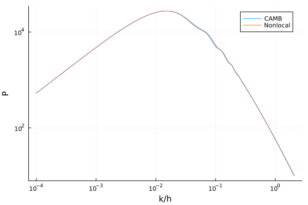
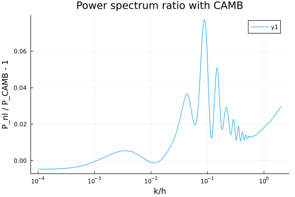
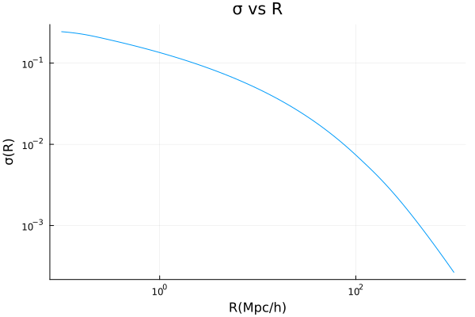
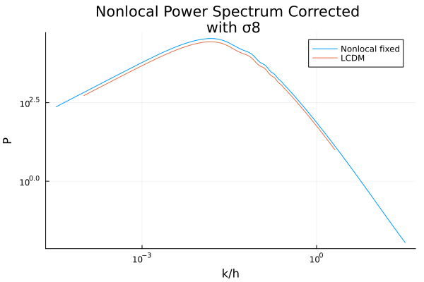
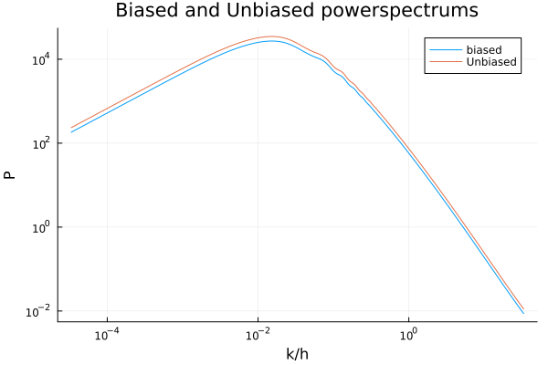

# Nonlocal-21cm-Cosmology
Our work regarding numerical simulation of nonlocal gravity and it's effect on the 21cm power spectrum.
This code includes numerical solvers for the field equation, power spectrum, transfer function, sigma 8, halo and 21cm bias, and density contrast.
Parameters can be easily modified to obtain different models and adjust the strength of non-local effects.

## Installation and Usage

Run the following command to clone the repository.<br>

```Git
git clone https://github.com/Reverse-Pyramid/Nonlocal-21cm-Cosmology
```

Navigate to the project, open Julia in the terminal, enter Pkg mode by hitting `]`, and then run the following command:

```julia-repl
pkg> activate Nonlocal_21cm
```

## Modifying for Custom Models
The Within the source code, the ParamFunctions.jl file includes all the parameters and functions of the non-local model by Dr. Bahram Mashhoon. The ParamsFunctionsLCDM.jl file includes the same functions for calculation of cosmological variables but is configured as a control LCDM model to test the proposed model against. <br>
To Modify the code for a custom model, change the parameters and the field equations which are calculated using the phi_solve method. The rest of the code should not need to be changed if the model is linear. Non-linear models need more modification that is model specific and will be left to the user.By default the transfer function used is the Eisenstein-Hu transfer function and can be changed by modifying the TransferFunctions.jl file.

## Package Overview

We only showcase the results from the visualization functions here to illustrate the package's capability. Documentation is still in the works.

### Parameters
---
We chose our parameters from "Planck 2018" and "Tabatabaei 2023 - LLNL: cosmological perturbations". <br>
Nonlocal Parameters: <br>
$\alpha = 0.0034$, $\beta = -1$ and $S(z) = \alpha (1 + z)^\beta$

### Field Equations
---

1. $\phi' + (\frac{k^2}{3\mathcal{H}}+\mathcal{H}+\frac{1}{2}\mathcal{B})\phi = \frac{\kappa a^2}{6(1+\bar{S})\mathcal{H}}\delta\rho = \frac{\mathcal{H} \rho_m}{2 \rho} \delta$
<br>

2. $\phi'' + (3\mathcal{H}+\mathcal{B})\phi' - (3w\mathcal{H}^2 + 3w\mathcal{H}\mathcal{B} +2\mathcal{B}^2)\phi + 2\mathcal{H}\frac{\delta S'}{1+\bar{S}} =0$
<br>

The second equation is solved by DifferentialEquations.jl ODE solver in reverse from $z=100$ to $z=0$ (or any other z). <br>
Since non-local effects are miniscule at $z=100$ the initial conditions of $\phi$ are calculated using $D$ and $D'$ (density contrast for $\Lambda \text{CDM}$) at $z=100$.<br>
Different values of $k$ can also be given to the function.
<br>



### Density Contrast
---
Using $\phi$ and $\phi'$ we can calculate the density contrast of both non-local and $\Lambda \text{CDM}$ models.
<br>



The ratio of density contrast of the two models can also be plotted.
<br>



### Transfer Function
---
We used the Eisenstein-Hu transfer function throughout our code.
This module is a direct port of a c++ module by Farbod Hassani.
<br>



### Power Spectrum
---
Using the growth function and EH transfer function we calculated, we can obtain the non-local power spectrum
using the equation below:
<br>

LLNL power spectrum: $PS = A {T_{EH}}(k) ^ 2 D(k,z) ^ 2$
<br>



The resulting power spectrum can be multiplied by a constant value so we fix this value <br>
by calculating $\sigma$ with regards to $R$. <br>
But first we can fix the max value of the non-local power spectrum, with the one obtained from CAMB
to illustrate the non-local effects.
<br>


<br>



### $\sigma_8$ Fixing
---
First $\sigma_8$ is calculated with regards to $R$ using the formula below: (at z=0)
<br>

sigma: $\sigma^2(R) = \int \frac{1}{2 \pi ^2} (\frac{k}{h})^2 P(k) W^2(k \cdot R) dk$

<br>

where $W(x)$ is a window function defined as:

<br>

window function: $W(x) = 3 \frac{\sin(x) - x \cos(x)}{x^3}$

<br>

The integration is done numerically using the Integrals.jl package and the trapezoidal rule method.<br>
An important consideration is that until now our power spectrum was calculated with equal logarithmic distribution
which causes issues with numerical integration methods. Thus, another power spectrum should be calculated with linear
distribution of scale which will integrated to plot $\sigma(R)$. 

After calculating $\sigma$ for the non-local power spectrum, we fix $\sigma_8$ with the $\Lambda \text{CDM}$ value calculated in the <br>
same manner. The scaled power spectrum will have the correct order of magnitude.
<br>


<br>



### Bias
---
As was discussed in a previous research group meeting, the Press-Schechter bias is defined as:
<br>

1. $b = 1 + \frac{\nu^2 - 1}{\delta_c}$

2. $\nu = \frac{\delta_c}{\sigma(R)}$

$R$ can be calculated by knowing tracer mass and density.
<br>

Radius $R = \left(  \frac{3 M}{4 \pi \rho}  \right) ^ {(\frac{1}{3})}$

<br>

The biased power spectrum is calculated as below:
<br>

Halo Power Spectrum: $P_{Halo} = b^2 P_M$

<br>



## Issues
If you have any questions or issues feel free to contact us here or by email.